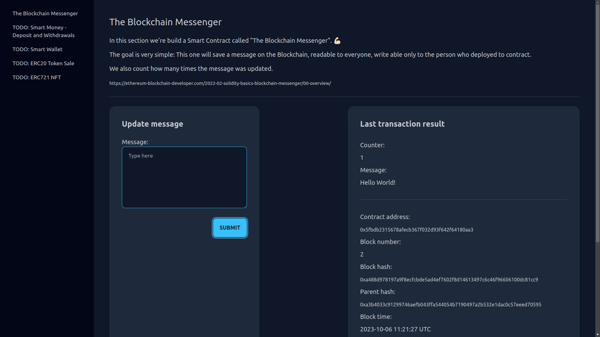

# My playground project to learn Rust and blockchain development

Learning Rust and Blockchain development on Ethereum using lessons from:
- [Ethereum Blockchain Developer](https://ethereum-blockchain-developer.com/2022-01-remix-introduction/00-overview/)
  - [The Blockchain Messenger](https://ethereum-blockchain-developer.com/2022-02-solidity-basics-blockchain-messenger/00-overview/)
  - [Smart Money - Deposit and Withdrawals](https://ethereum-blockchain-developer.com/2022-03-deposit-withdrawals/00-overview/)
  - [Shared Wallet](https://ethereum-blockchain-developer.com/2022-04-smart-wallet/00-overview/)
- [Solidity by Example](https://docs.soliditylang.org/en/latest/solidity-by-example.html)
  - [Voting](https://docs.soliditylang.org/en/latest/solidity-by-example.html#voting)

stack:
Rust, Actix, Ethers-rs, Solidity, Foundry, Tailwind (DaisyUI), Tera, HTMX


## Set-up

- install Foundry, Solidity (solc), Tailwind and Direnv

```bash
make prepare-env
```

- optionally install web3 CLI to interract with the Anvil testnet (`cast` also works)

```bash
make install-web3cli
```

- start the Anvil local testnet

```bash
make start-testnet
```

- see the accounts and private keys on the start-up output and update `PRIVATE_KEY` AND `ACCOUNT` in the `.envrc` file and update the env vars with `direnv allow`


## Interact with the testnet

Use the Makefile targets to interract with the Smart Contracts.

- deploy contract from a lab (e.g. Lab1)
```bash
make lab1-deploy
```

- export the returned contract address to the `CONTRACT_ADDRESS_THEBLOCKCHAINMESSENGER` env var, or do the two steps in a single step:
```bash
export CONTRACT_ADDRESS_THEBLOCKCHAINMESSENGER=$(make lab1-deploy)
```

- get the transaction details
```bash
make get-tx TX_HASH=0x5a6f304960784db9bee2df3de0c8e91b4afdfda748fa3fb80527baa786e53fab
```

- call contract method
```bash
make lab1-updateTheMessage MSG="Hello World!"
```

- get the last contract data or at a given block
```bash
make lab1-get-data
make lab1-get-data-at-block BLOCK_NR=1
```

- get the account balance
```bash
make get-balance
```


## Run the app

You can use already deployed Smart Contracts by setting the contract addresses in the `.envrc` file and enabling them with `direnv allow`.

- start the app
```bash
make run
```

- open the page on [localhost:8080](http://localhost:8080)

- open Lab1 (The Blockchain Messenger), wait until the contract gets deployed (in case you didn't set the contract address in `.envrc`) and submit a new transaction


