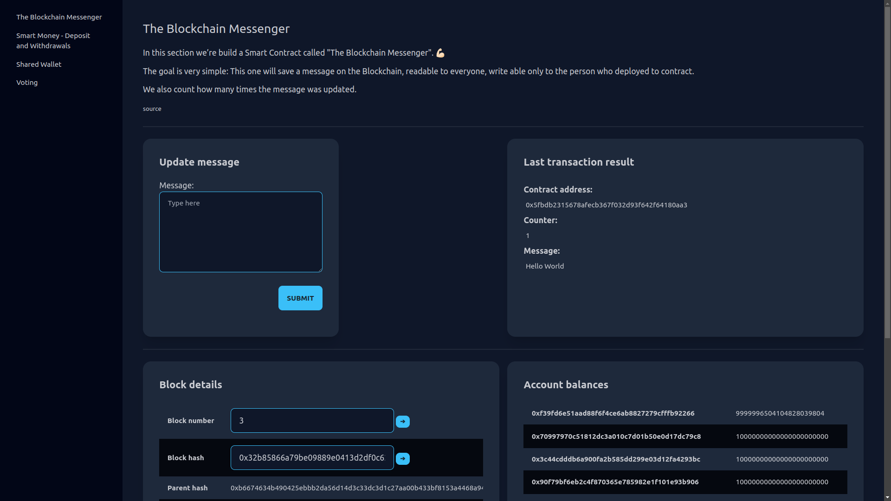

# My playground project to learn Rust and blockchain development

Learning Rust and Blockchain development on Ethereum using lessons from https://ethereum-blockchain-developer.com/2022-01-remix-introduction/00-overview/

stack:
Rust, Actix, Foundry, Tailwind (DaisyUI)


## Set-up

- install Foundry, Solidity (solc), Tailwind and Direnv

```bash
make prepare-env
```

- optionally install web3 CLI to interract with the Anvil testnet (`cast` also works)

```bash
make install-web3cli
```

- start the Anvil local testnet

```bash
make start-testnet
```

- see the accounts and private keys on the start-up output and update `PRIVATE_KEY` AND `ACCOUNT` in the `.envrc` file and update the env vars with `direnv allow`


## Interract with the testnet

- deploy contract from a lab (e.g. Lab1)
```bash
make deploy-lab1
```

- get the transaction details
```bash
make get-tx TX_HASH=0x66ddb8c97a027b89a8209a77358e138d22309c5e2894e5f295cba12eea173a8e
```

- call contract method
```bash
make send-lab1 MSG=Hello\ World!
```

- get the last contract data or at a given block
```bash
make get-lab1-data
make get-lab1-data-at-block BLOCK_NR=1
```

- get the account balance
```bash
make get-balance
```


## Run the app

- start the app
```bash
make run
```

- open the page on [localhost:8080](http://localhost:8080)

- open Lab1 (The Blockchain Messenger), wait until the contract gets deployed and submit a new transaction

